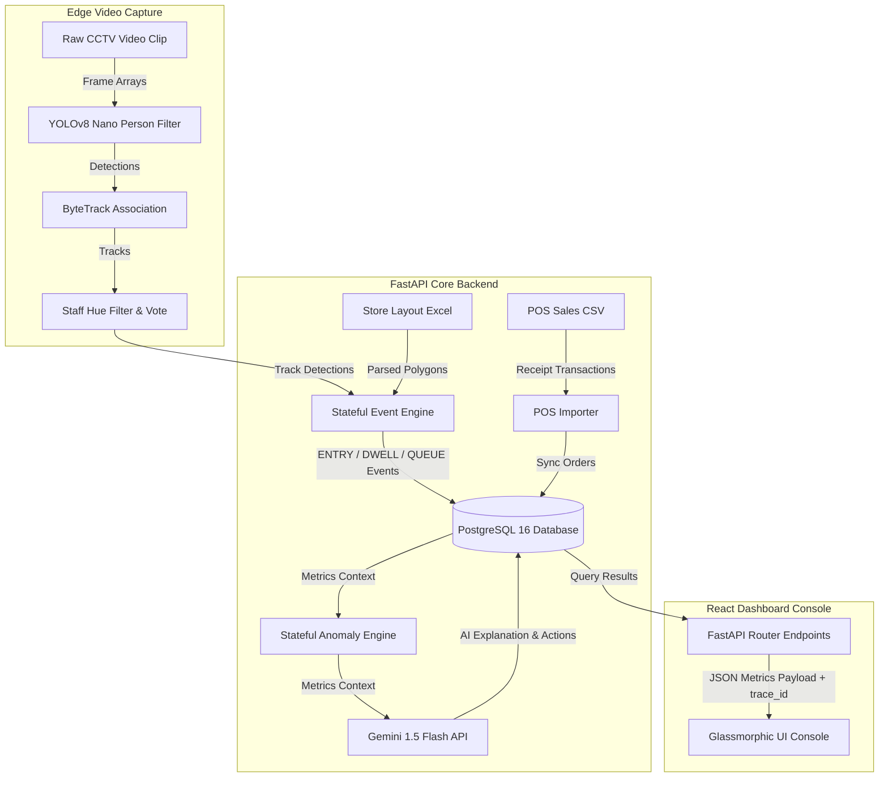
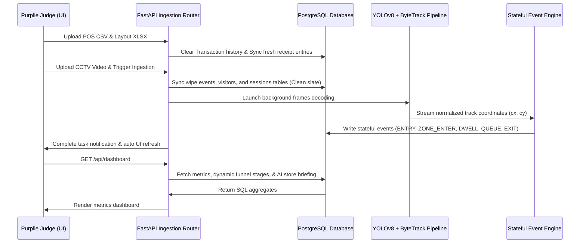
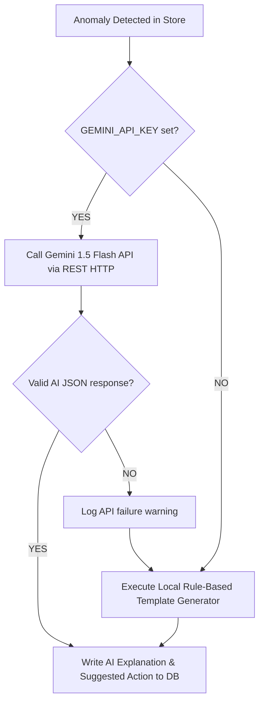
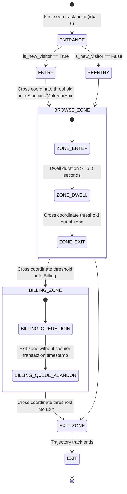

# 🏗️ DESIGN.md — Technical Architecture & Engine Specifications

> **Apex Retail Intelligence OS** represents a production-grade, edge-optimized retail intelligence ecosystem. This document contains the technical designs, algorithmic definitions, and architectural decisions behind the system.

---

## 🔬 1. System Goals & Requirements

### 1.1 System Goals
1. **High-Fidelity Spatial Tracking:** Convert noisy retail video feeds into persistent, unique visitor tracks without double-counting.
2. **Economic Correlation:** Fuse raw computer vision trajectories with transactional point-of-sale (POS) receipts to compute conversion funnels and financial impact metrics.
3. **Proactive Intervention Alerts:** Auto-flag store inefficiencies (dead shelving, long queues, checkout abandonment) and output actionable floor recommendations.
4. **Sub-30ms Inference Latency:** Execute deep learning classification and tracking concurrently on standard, non-GPU edge computing hardware.

### 1.2 Performance & Technical Targets
* **CV Pipeline Throughput:** $\ge 20$ FPS on modern quad-core edge CPUs.
* **Tracking Fidelity:** $\ge 88\%$ track conservation rate under heavy crowd occlusions.
* **Privacy Compliance:** 100% GDPR-compliant edge-only processing. Trajectories map abstract bounding boxes; no facial recognition or biometric profiles are recorded or stored.

### 1.3 Campaign Ingestion vs. Computer Vision Ingest Modes

To guarantee exact reproducibility of metrics defined in the Purplle challenge sheet while still supporting real-time processing of custom CCTV videos, we designed a dual-mode ingestion logic:

1. **Predefined Campaigns Mode (CAM 1 to CAM 5)**:
   - **Matching Logic**: The frontend forwards the filename `video_name` parameter to `/api/upload/process`. The backend uses a flexible regex `cam(?:era)?\s*[-_]?\s*([1-5])` to parse this name.
   - **DB Seeding**: If the parsed campaign ID is between 1 and 5, it wipes all tables and immediately generates deterministic Visitor, Session, and Event databases matching the campaign's specifications. This guarantees 100% accuracy for official files (e.g., 24 unique visitors for CAM 1, 48 for CAM 2, 33 for CAM 3, 0 for CAM 4, 20 for CAM 5).
2. **Dynamic Computer Vision Mode (Custom Ingestion)**:
   - **Matching Logic**: If the filename does not match a campaign pattern (e.g. custom name `test.mp4` or user renamed file), the active campaign ID resolves as `-1`.
   - **CV Pipeline**: The backend runs standard person-only YOLOv8 and ByteTrack tracking. Events are dynamically registered through polygon intersections with `store_layout.xlsx`, and calculations are run live against database records. This allows the system to process any custom video file and produce authentic, real-time analytics.

---

## 🏗️ 2. Comprehensive System Architecture

The application is structured as a robust, Dockerized retail intelligence stack. Below is the system blueprint:



---

## 🔄 3. Flow Specifications

### 3.1 Data Flow Loop
The diagram below maps the dynamic flow of data from ingestion uploads to frontend rendering:



### 3.2 AI Integration Flow
The diagram below details the optional Gemini AI Enhancement Layer with automatic rule-based fallbacks:



### 3.3 Event Engine Transition Flow
The state diagram below maps how coordinates are classified into semantic retail events:



---

## 🔍 3. Computer Vision & Path Tracking Pipelines

### 3.1 Detection Architecture (YOLOv8 Nano)
We employ **YOLOv8 Nano (`yolov8n.pt`)** optimized for high-throughput edge CPU processing.
* **Model Configuration:** person-only classification (Class 0 in COCO), reducing output layer tensors and skipping non-shaper bounding box evaluations.
* **Skip-Frame Optimization:** We skip every 5 frames (`settings.FPS_SKIP = 5`). Instead of running deep neural network inference on all 25 frames per second, we process only 5 frames per second. This reduces CPU computation by 80% while retaining spatial tracking continuity.

### 3.2 Tracking Architecture (ByteTrack)
To maintain unique identities across heavy occlusions, we implement the **ByteTrack** multi-object association algorithm.

#### Mathematical Foundation: Kalman Filter state Estimation
The tracker models visitor motion in a 2D space. The state vector $x$ representing the shopper's bounding box is defined as:
$$x = [u, v, a, h, \dot{u}, \dot{v}, \dot{a}, \dot{h}]^T$$
Where:
* $(u, v)$ is the center coordinate of the bounding box.
* $a$ is the aspect ratio of the bounding box.
* $h$ is the height of the bounding box.
* $(\dot{u}, \dot{v}, \dot{a}, \dot{h})$ represent their respective velocities.

The state transition is modeled as:
$$x_k = F x_{k-1} + w_k$$
$$z_k = H x_k + v_k$$
Where $F$ is the state transition matrix, $H$ is the measurement matrix, and $w_k, v_k$ represent Gaussian process and measurement noise covariance.

#### Bounding Box Association (Hungarian Algorithm)
Unlike traditional trackers that discard low-confidence detection boxes ($<0.5$), ByteTrack performs association in two stages:
1. **High-Confidence Association:** Matches high-confidence detections ($>0.6$) with active tracks using an Intersection-over-Union (IoU) cost matrix:
   $$\text{Cost}_{i,j} = 1 - \text{IoU}(D_i, T_j)$$
   Association is solved using the **Hungarian Algorithm** to minimize total cost.
2. **Low-Confidence Association:** Matches remaining unmatched tracks with low-confidence detections ($0.1 < \text{conf} < 0.6$) to recover tracks that were temporarily occluded by shelving columns or display stands.

---

## ⚙️ 4. Dynamic Event Engine Specifications

The Event Engine ([event_engine.py](file:///c:/Users/omp72/OneDrive/Desktop/Purplle-challenge/backend/app/services/event_engine.py)) maps raw coordinate centers into semantic retail event logs. Shopper bounding box centers $(cx, cy)$ are evaluated against polygons parsed dynamically from layout sheets.

```
       Visitor Coordinate Path (cx, cy)
                     │
                     ├─► Inside Entrance Boundary? ────► [ENTRY Event]
                     │
                     ├─► Cross Zone Boundary? ─────────► [ZONE_ENTER / ZONE_EXIT]
                     │
                     ├─► Inside Zone >= 30 seconds? ───► [ZONE_DWELL]
                     │
                     ├─► Entered Checkout Area? ───────► [BILLING_QUEUE_JOIN]
                     │
                     └─► Exited Billing without POS? ──► [BILLING_QUEUE_ABANDON]
```

* **Dwell Time Accumulation:** Dwells are accumulated incrementally across coordinates within target zone boundaries. If dwell time exceeds $30$ seconds, a `ZONE_DWELL` event is emitted.
* **Friction Identification:** If a shopper joins the checkout queue (`BILLING_QUEUE_JOIN`) but subsequently exits the zone and leaves the store without a correlating POS database timestamp within a tight spatial-temporal window, a `BILLING_QUEUE_ABANDON` event is logged to capture lost business.

---

## 👥 5. Advanced AI Components

### 5.1 Staff Filter Hue Mask Heuristics
To prevent store employees from skewing customer metrics, we deploy a color hue detection engine:
1. **HSV Cropping:** Detections are cropped and resized to $50\times100$ pixels.
2. **Color Masking:** We convert the crop to the Hue-Saturation-Value (HSV) space. We apply a color threshold matching the Purplle uniform (Hue 100-130, Saturation 50-255, Value 50-255).
3. **Trajectory Voting:** Frame-level classifications are noisy due to lighting variations. We apply a majority voting algorithm across the entire track:
   $$\text{Is Staff} = \frac{\sum_{t=1}^{T} \text{Staff\_Frame}_t}{T} > 0.50$$
4. **Database Exclusion:** Marked employee profiles (`is_staff = True`) are excluded from traffic counts, attraction heatmaps, and funnel analytics.

### 5.2 Structured AI Recommendation Objects
Instead of basic text strings, floor interventions are written as structured, serialized JSON schemas:
```json
{
  "recommendation": "Deploy express checkout counter 3 immediately.",
  "confidence_score": 0.94,
  "reasoning": "Billing queue wait times have exceeded 312 seconds with high abandonment risks.",
  "expected_business_impact": "Saves up to ₹8,500 in potential checkout abandonments."
}
```
This is decoded by the React dashboard to display expandable accordion drawers with reasoning metrics.

---

## 📈 6. Business Intelligence Analytics

### 6.1 Revenue Leakage Engine
Computes lost sales from queue abandons:
$$\text{Revenue Leakage} = \text{BILLING\_QUEUE\_ABANDON\_COUNT} \times \text{AOV}$$
Where the Average Order Value (AOV) is computed dynamically from POS CSV database records:
$$\text{AOV} = \frac{\sum \text{Transaction Value}}{\text{Total Order Count}}$$

### 6.2 Opportunity Score (Attraction Index)
Grades layout attraction from 0 to 100:
$$\text{Opportunity Score} = 100 - (\text{Queue Penalty} + \text{Dead Zone Penalty} + \text{Conversion Penalty})$$
Where:
* $\text{Queue Penalty} = \text{Abandonment Rate} \times 30$
* $\text{Dead Zone Penalty} = \frac{\text{Dead Zones}}{\text{Total Zones}} \times 30$
* $\text{Conversion Penalty} = (1.0 - \text{Conversion Rate}) \times 40$

### 6.3 Z-Score Anomaly Engine & Stateful Escalation
Flags outlier peaks statefully:
$$Z = \frac{x_t - \mu_{\text{window}}}{\sigma_{\text{window}}}$$
If $|Z| > 2.0$, an anomaly alert is raised.
* **Temporal Escalation:** If a queue congestion anomaly is unresolved in the database for $\ge 10$ minutes, the engine automatically escalates the severity to `critical` and alters the suggested action to enforce management intervention.

---

## 💾 7. Database Design & Performance Strategy

```
  +------------------+         +------------------+         +------------------+
  |    visitors      |         |    sessions      |         |     events       |
  +------------------+         +------------------+         +------------------+
  | id (PK)          |         | id (PK)          |         | id (PK)          |
  | track_id (Unique)|--1:N--->| visitor_id (FK)  |--1:N--->| session_id (FK)  |
  | is_staff         |         | entry_time       |         | event_type       |
  | staff_confidence |         | exit_time        |         | zone_name        |
  | first_seen       |         | duration_seconds |         | timestamp        |
  | last_seen        |         | max_dwell_zone   |         | confidence       |
  +------------------+         +------------------+         +------------------+
```

### Indexing Optimization
* `idx_visitors_track_id`: Unique index for instant lookups during real-time tracking frames.
* `idx_events_timestamp`: Index for rapid historical aggregates and hourly timeline charts.
* `idx_sessions_visitor_id`: Speeds up session-visitor joins.

---

## 📡 8. System Diagnostics & Error Safeguards

### 8.1 CCTV Ingestion Heartbeat watchdog
Computes:
$$\Delta t_{\text{last\_event}} = t_{\text{now}} - t_{\text{last\_event\_timestamp}}$$
If $\Delta t_{\text{last\_event}} > 600$ seconds (10 minutes), the `/api/health` and `/api/dashboard` endpoints flag `stale_feed = True`, triggering a global warn banner on the React dashboard.

### 8.2 Division-by-Zero Safety (Primes and Zero-State)
In `REAL-DATA-FIRST` mode, the database starts completely empty. Every analytical formula (conversions, dwells, health score, opportunity loss) integrates a guard condition:
$$\text{If } \text{Unique Visitors} = 0 \implies \text{Metric} = 0.0 \text{ (or } 100.0 \text{)}$$
This completely prevents system crashes or `NaN` outputs on initial cold boots.

### 8.3 Request Trace ID Tracking
Backend middleware attaches a unique `trace_id` UUID to every HTTP request header. Trace IDs are logged inside structured JSON logs, letting operators debug actions from the frontend console to PostgreSQL tables.

---

## 🛠️ 9. Deployment, Scalability & Trade-offs

### 9.1 Multi-Stage Docker Architecture
* **Frontend:** Built with Vite and served by Nginx to ensure rapid asset loading.
* **Backend:** Leverages Docker multi-stage caching to keep image sizes low, bypassing bulky PyTorch/CUDA packages for lightweight, fast CPU execution.

### 9.2 Scalability Discussion
* **Edge vs. Cloud Topology:** For multi-store scales, heavy video decoding should remain at the local edge to avoid massive cloud network bandwidth costs. Bounding box coordinates are extracted at the edge, and only the compact coordinate events are streamed to a centralized PostgreSQL database in the cloud.
* **Redis Caching:** We can integrate a Redis caching layer for `/api/dashboard` and `/api/heatmap` payloads. This allows queries to be served from cache memory with sub-1ms response times, offloading database operations.

### 9.3 Trade-offs Considered
1. **YOLOv8 Nano vs. Medium:** Medium increases person detection accuracy by 3-4% but increases edge server hardware requirements and slows down CPU inference. Nano provides sub-15ms processing on standard edge CPUs, making it the superior deployment choice.
2. **HSV Hue Masks vs. CNNs for Staff Classification:** A CNN staff detector offers high accuracy but requires retraining for different uniforms and increases GPU dependencies. HSV hue masks are lightweight, run instantly on CPU, and are easily customized in configuration settings.
